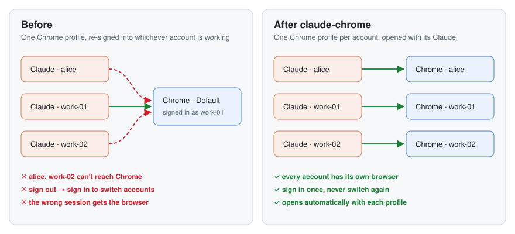
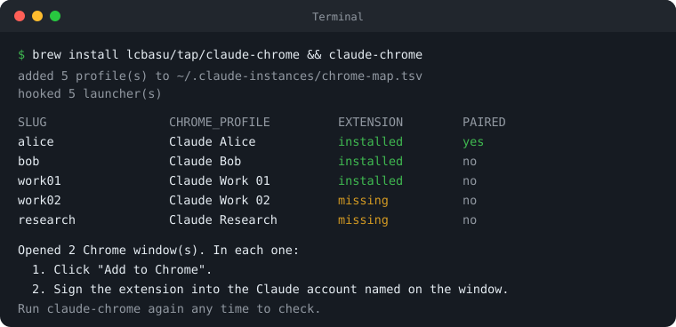

# claude-chrome

**Give every Claude Desktop account its own Chrome, permanently.**

If you run several Claude accounts side by side (for example with [Claude Profiles](https://github.com/jyito/Claude-Profiles)), they all fight over one Chrome. Whichever account the Claude extension is signed into gets the browser. The others either can't reach Chrome or grab the wrong session, and the only fix is to sign out and sign back in, over and over.

`claude-chrome` gives each Claude account its own Chrome profile and opens that profile automatically whenever you launch its Claude. You set it up once and never switch again.



## Why this happens

| Fact | Effect |
|---|---|
| A Claude Desktop instance started with `--user-data-dir` (how multi-account launchers work) reaches Chrome only through Anthropic's hosted bridge, not the local socket. Its log says `local pairing disabled for this launch: userData relocated`. | Your Claude instance can only find a Chrome whose extension is signed into **the same Claude account**. |
| Each Chrome profile has one Claude extension, signed into one account at a time. | One Chrome profile can serve only one Claude account. |
| If Claude's remembered browser isn't connected and exactly one other one is, it uses that one. | A shared Chrome profile ends up attached to the wrong session. |

The fix follows directly: **one Chrome profile per Claude account.** `claude-chrome` automates that.

## Install

Requires macOS, Google Chrome and [Claude Profiles](https://github.com/jyito/Claude-Profiles).

```bash
git clone https://github.com/lcbasu/claude-chrome.git
cd claude-chrome && ./install.sh
```

This puts `claude-chrome` in `~/.local/bin`. Set `PREFIX` to install somewhere else.

## Set up (once)



```bash
claude-chrome init        # map every Claude profile to a new Chrome profile
claude-chrome install     # open that Chrome profile whenever its Claude launches
claude-chrome setup-all   # open each Chrome profile on the Claude extension page
```

Then, in each Chrome window that opened:

1. Click **Add to Chrome** to install the Claude extension.
2. Sign the extension into **that** profile's Claude account. Never sign it out.
3. Sign in to the websites that account needs.

Then pair each Claude instance once: in that instance, say **"switch browser"** and click **Connect** in its Chrome window. Claude saves that browser and picks it automatically from then on. `claude-chrome list` shows `PAIRED: yes` once this is done.

| Claude picks… | when |
|---|---|
| the paired browser | it is connected — always wins |
| the only browser | exactly one is signed into this account |
| nothing, it asks | several are signed in and none is paired |

If another Chrome profile's extension is still signed into one of these Claude accounts, sign it out there. Otherwise it competes for the same account.

## Commands

| Command | What it does |
|---|---|
| `init` | Adds a row to the map for every Claude Profiles app. Safe to re-run. |
| `list` | Shows each profile, whether its Claude extension is installed, and whether its Claude instance is paired to it. |
| `open <slug>` | Opens that account's Chrome profile. |
| `setup <slug>` | Opens it on the Claude extension's store page. |
| `setup-all` | `setup` for every mapped profile. |
| `install` | Adds a one-line hook to each Claude Profiles launcher. Safe to re-run. |
| `uninstall` | Removes the hooks. |

The map lives at `~/.claude-instances/chrome-map.tsv`: one tab-separated line of `slug`, Chrome profile folder and Chrome profile name. Edit it to point an account at a different Chrome profile.

## How it works

- **New Chrome profiles** are created by launching Chrome with `--profile-directory=<folder>`. Before the first launch, the tool writes the profile's name so the window shows it. Existing profiles are never modified.
- **The hook** is one line inserted before the `exec open … Claude.app` line in each Claude Profiles launcher. That launcher runs both from the dashboard's Open button and from the Dock. `uninstall` removes it.
- **Re-run `claude-chrome init && claude-chrome install`** after adding a profile in Claude Profiles, because new launchers are created without the hook.

## Limits

- Chrome won't let one Google account sync into two profiles. Sign in to websites normally instead of using Chrome Sync.
- A Chrome profile must have a window open for its extension to connect. The hook opens one when Claude launches; `claude-chrome open <slug>` reopens it.
- The bridge behaviour above was read from Claude Desktop's code and logs, not from any published spec, and may change in future releases.

## Development

```bash
tests/test.sh             # sandboxed: fake apps, fake Chrome, nothing launched
shellcheck claude-chrome tests/test.sh install.sh
```

## License

MIT. Not affiliated with Anthropic or Google. "Claude" and "Chrome" are trademarks of their owners.
